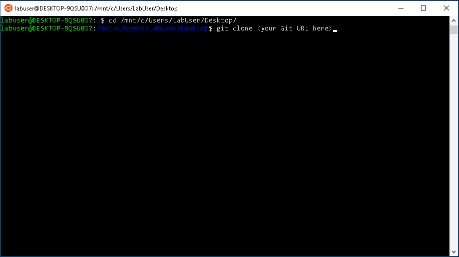
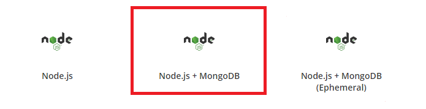

# Getting started with OpenShift Origin on Azure

OpenShift is a container deployment and management tool developed by Red Hat. It is built on top of Docker containers and uses Kubernetes as its container orchestrator. OpenShift Origin is the open source upstream community OpenShift project; Red Hat also sells OpenShift Container Platform, which is an enterprise-grade container also developed and supported by Red Hat.

In this lab, you will get a taste for creating and deploying applications using OpenShift running on Azure infrastructure. You will create a Node.js application with a MongoDB database, push updates to the code base, and see updates deploy in real time with minimal work needed.

## Prerequisites:
For this lab, you will need the following:
1. A GitHub account (if you don't have one, this lab is still doable but becomes significantly less interesting - you won't be able to use the fancy automated Git deployment that ties together VSCode, GitHub, and OpenShift)
    - We _strongly_ suggest signing up for a GitHub account. You can sign up for a GitHub account [here](https://github.com/join). It takes less than a minute!
1. Visual Studio Code installed (already done for you in the lab machine)
1. An OpenShift Origin cluster (predeployed for you)

    For the purposes of this lab, we have deployed 6 OpenShift Origin clusters on Azure. The links are as follows:
    - [aka.ms/openshift1](https://aka.ms/openshift1)
    - [aka.ms/openshift2](https://aka.ms/openshift2)
    - [aka.ms/openshift3](https://aka.ms/openshift3)
    - [aka.ms/openshift4](https://aka.ms/openshift4)
    - [aka.ms/openshift5](https://aka.ms/openshift5)
    - [aka.ms/openshift6](https://aka.ms/openshift6)

    Please use the cluster corresponding to your lab machine. For example, if you are at machine #1, you would use the cluster located at aka.ms/openshift1.

## Part 1: Starting with OpenShift on Azure
Login to your OpenShift cluster with the following credentials:

        Username: clusteradmin
        Password: DoNotCheckMeIn!


Once you have logged in, you will see all the images available to you. Note that Open Service Broker has already been configured so that you can also deploy Azure services from within OpenShift!

Play around with the UI if you want or continue to part 2.

## Part 2: Starting with GitHub
A fork in Git is a copy of a repository which allows you to freely experiment with changes without affecting the original project. Most commonly, forks are used to either propose changes to someone else's project or to use someone else's project as a starting point for your own idea ([Source](https://help.github.com/articles/fork-a-repo/)).

- Fork the project from https://github.com/asinn826/nodejs-ex-oscon2018 to your own GitHub account by clicking the Fork button on the top right of the repository
    - You will see a dialog asking you where to fork this repository. Select your Github account.
- You will be redirected to your fork of the repository afterward. Clone the forked project onto your local machine 
    - Click the green "Clone or download" button on the top right of the page and copy the URL to your clipboard
    - Click the Ubuntu icon on the taskbar, and navigate to an easy-to-remember directory
        - We suggest ```/mnt/c/Users/LabUser/Desktop```
    - Type ```git clone``` and right click the mouse button to paste the URL from the clipboard

    

If you don't have a GitHub account, you can just clone the project above without forking it.

## Part 3: Starting with Visual Studio Code
Visual Studio Code is a cross-platform code editor developed by Microsoft that supports a wide selection of languages and features. One cool feature within VSCode is native Git integration. We will be using the Git integration during this lab. 

- Open the cloned project in VSCode by clicking "Open filder..." from the Welcome screen that shows up and navigating to your cloned directory

- Click on Select folder to open the project
- Play with it if you want
    - The only file we will be editing in this lab will be the ```index.html``` file located within the views directory

## Part 4: Deploying an image to a container
Now we will deploy an image to a container within OpenShift Origin
- Go back to OpenShift
- Deploy a NodeJS + MongoDB ephemeral image
    - Ephemeral image means that your application database will be lost if the host VM is rebooted
    
- Under "Add to Project", select "Create Project" and give your project a name you will remember
- Leave all the options as they are, except for the Git Repository URL
- When asked for a Git repository, put in the link to your forked repository from Part 3 above.
    - If you don't have a GitHub account, just use the link provided above
    
- Click Create, then click the link that pops up to go to the configurations
    
- Navigate to Builds -> Builds and click on the name of the build
- Navigate to Configuration and copy the GitHub Webhook URL (skip this step if you don't have a GitHub account)
    
- Go back to the Overview page and click on the *.nip.io link on the top right if you want to see your application live

## Part 5: Play with the source to image workflow
> NOTE: you will not be able to do this entire part if you don't have a GitHub account

- Go to your forked GitHub repository, and go to Settings -> Webhooks
    - You will be asked for your Github password since modifying webhooks is a powerful operation. You will soon see an example of how powerful this is!
- Click the "Add webhook" button on the top right
- Paste the URL you copied in Part 4 into the Payload URL box
- Change the Content type to "application/json"
- Disable SSL verification (the OpenShift cluster deployed uses self-signed certificates, so this verification will need to be disabled)
- Click "Add webhook"
    
- Go back to VSCode and open up the file views/index.html
- Make a change to the HTML
    * You could try adding an extra sentence to a title somewhere - something small but something you will remember
- Open the Source Control view from the left pane in VSCode
- Note the changed files; click the "+" button that appears when you hover over them to add them to staging
- Type your commit message, then ctrl+enter to commit
- You have 2 options to do a ```git push```: You can use the 3 dots on the top right or use bash in the built-in terminal
    - 3 dots: See screenshot below
        
    - Terminal: 
        - Press ctrl + ` and select bash
        - Navigate to your repo directory
        - ```git push```
        
- Go back to your project overview in OpenShift, and notice a new build has started
- Once the build has completed, go to the *.nip.io link and refresh - note that it has updated to show your changes without you needing to do anything!

## Part 6 (optional): Open Service Broker for Azure - OpenShift integration
- Notice that in the home page you also see Azure services in addition to application images
- [OSBA for Azure](https://open.microsoft.com/2018/06/27/announcing-open-service-broker-for-azure-1-0-kubernetes/) has now moved out of preview, and is now 1.0 - you can deploy various services directly from OpenShift

